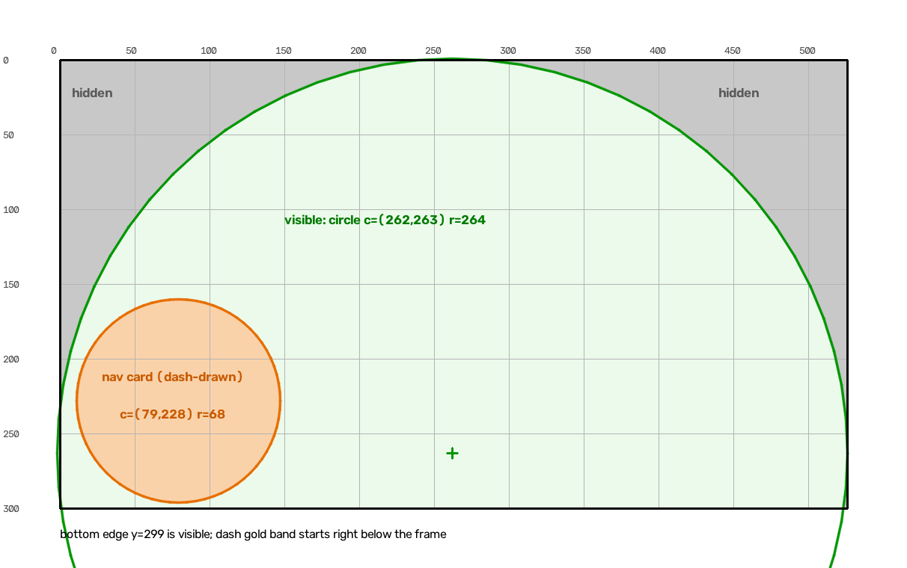

# Dash visible area

The stream is 526×300, but the Tripper's round glass and the dash's own
navigation card hide part of it. These are the numbers to place overlays
against, so layout changes don't need ride-and-retry.

Coordinates are stream-frame pixels: origin top-left, x right, y down.

## Visible area

**A circle, centre (262, 263), radius 264.** A pixel is visible when
`hypot(x - 262, y - 263) <= 264`. The circle reaches past the frame's
bottom and sides, so the frame's straight edges clip it there.

Visible x range per row:

| y   | visible x |
|-----|-----------|
| 0   | 233 – 292 |
| 25  | 146 – 378 |
| 50  | 105 – 419 |
| 100 | 54 – 470  |
| 150 | 23 – 501  |
| 200 | 5 – 519   |
| 250 | 0 – 525   |
| 299 | 0 – 525   |

- **Top corners are the big loss.** At y = 50 roughly 105 px are hidden on
  each side.
- **Bottom edge is fully visible.** The dash's gold status band starts
  right below the frame, not over it.
- **No distortion.** The test pattern's rings come out round (rectified
  photos match the reference within 3 px), so x and y scale the same.

## Dash navigation card

While navigating, the dash draws its own turn card over the stream:
**a disc, centre (79, 228), radius 68**, which covers x 11–147, y 160–296.
The disc includes the card's gold outline. It holds the maneuver glyph and
the distance only.

The rest of the active-nav packet (ETA, total distance, road name,
second maneuver) is not drawn over the stream. The ETA shows in the gold
band below the frame; the others did not show at all.

It was measured with "888 m" and a right-turn glyph. The disc itself is a
fixed shape; only its content changes.

## How it was measured

1. The `diag/dash-test-pattern` branch streams a calibration pattern
   instead of the map: a 10/50 px grid, labelled coordinates, a red
   frame border and rings around (263, 150) every 25 px. While navigating
   it sends a fixed worst-case active-nav packet.
2. Four photos of the real dash: two in free ride, two in navigation.
3. Each photo was mapped back to frame coordinates with a homography
   fitted to the pattern (OpenCV ECC). Phase correlation of the rectified
   photos against the reference leaves ≤ 3 px residual in each
   region.
4. The visible circle was fitted to the 8 points where the r = 175–250
   rings meet the bezel (0.5 px fit residual), then checked by
   overlaying it on the rectified photos. The nav card circle was fitted
   to its light fill plus the gold outline; it matched in both nav photos
   to 1 px.

**Accuracy: about ±3 px.** Keep overlays at least 4 px inside the circle
and outside the card.

## Re-measuring

If a firmware update or another bike model moves things, re-run the same
procedure. Build `diag/dash-test-pattern`, take the photos head-on, and
update this file plus any test that encodes these numbers.
