# Tripper Dash — Maneuver Glyph Catalog

Empirical glyph rendering for every byte value `0x00..0x81` of the
**maneuver TLV** sent to the Royal Enfield Tripper Dash (model "K1G",
bike: Guerrilla 450 / Himalayan 450).

The dashboard receives a single-byte maneuver code in the K1G TLV:

```
05 02 00 01 <maneuver_byte>           # primary form
05 03 00 02 <maneuver_byte> <unused>  # secondary form (observed)
```

This document is the ground truth for what each byte renders as in the
**active-nav bubble** (the round overlay shown over the map view when
turn-by-turn is active).

## Capture context

- **Date**: 2026-06-21
- **Source video**: `IMG_4587_2.mov` (1080p HEVC, 30 fps, 400 s, rotated +22° CW)
- **Capture method**: [`ManeuverScannerLoop`](../../TripperDashPP/Navigation/ManeuverScannerLoop.swift)
  walks `0x00..0xFF` with `holdSeconds=5`. The phone sends
  `primaryManeuver: byte` together with `roadName: "SCAN 0xNN"` for the
  **same** byte — see [`ManeuverScannerLoop.swift#sendNavPacket`](../../TripperDashPP/Navigation/ManeuverScannerLoop.swift#L183). The dash renders both: the active-nav bubble on
  the left, and the burned "SCAN 0xNN" label at the bottom. **The
  burned label is the authoritative ground truth.**
- **Coverage**: `0x00..0xFF` (full 8-bit range). Bytes `0x00..0x81` produce
  visible bubble glyphs (130 distinct entries captured). Bytes
  `0x82..0xFF` are **hidden bubble** — dashboard suppresses the overlay
  entirely for every value in that range (manually verified
  byte-by-byte on the bike).
- **Extraction**: each glyph crop is **self-labeled** — the SCAN text under the
  bubble appears in every PNG so you can verify the byte → glyph mapping
  by eye without trusting any external mapping.

## Glyph index status

The catalog re-build on 2026-06-21 replaced the earlier timing-based
mapping (which was misaligned) with **OCR-anchored** mapping that reads
the burned SCAN label directly:

| Status | Count | Meaning |
|--------|-------|---------|
| ✅ **anchor** | 85 | OCR of the SCAN label parsed cleanly — image and label match |
| 🟡 **interpolated** | 43 | OCR missed in that frame, image picked by linear interp between neighbouring anchors — verify against the SCAN label visible inside the PNG |
| 📸 **user photo** | 2 | `0x00`, `0x01` captured directly from dash via phone photo (user-supplied, SCAN label visible) |
| ⚫ **hidden bubble** | 126 | `0x82..0xFF` — dash renders nothing (overlay fully suppressed), confirmed by manual byte-by-byte field-check |

A glyph marked **interpolated** is still a real bubble frame from the
video — the OCR just couldn't read the label cleanly in that specific
frame. The SCAN label inside the PNG is the ground truth; if it doesn't
match the row's byte, the row is misaligned and needs re-extraction.

## Quick reference (user-confirmed; rest pending re-classification)

| Byte | Glyph | Description |
|------|-------|-------------|
| `0x00` | 📍↑ | **Arrival — destination AHEAD** (pin directly above straight arrow, user-photo) |
| `0x01` | 📍↑ ← | **Arrival — destination ahead-LEFT** (pin top-left + straight arrow, user-photo) |
| `0x02` | 📍AHEAD-variant | (similar to 0x01, pin position differs) — **pending re-classify** |
| `0x03` | ⤵ | **Y-fork up — stay LEFT** (thicker left leg, user-confirmed in earlier scan) — re-verify against scan2 |
| `0x04` | ⤴ | **Y-fork up — stay RIGHT** (thicker right leg, user-confirmed) — re-verify against scan2 |
| `0x05`..`0x81` | various | Captured but **not yet labelled** — see catalog below |
| `0x82`..`0xFF` | ⚫ hidden | **No bubble rendered** — overlay fully suppressed (useful as "no maneuver" signal) |

> **Important**: the earlier text descriptions for `0x05..0x81` were
> derived from a misaligned mapping and have been removed. Re-labeling
> proceeds row-by-row from the actual glyph in each PNG.

## How to send a custom maneuver

The dash will render any glyph code you send. From phone-side code:

```swift
// Send single primary maneuver:
await link.sendActiveNav(
    primaryManeuver: 0x33,                    // any byte 0x00..0x81 from catalog
    primaryDistanceMeters: 200,
    primaryUnit: 0x30,                         // 0x30 = metres
    totalDistanceMeters: 1200,
    totalDistanceUnit: 0x30,
    useCommaDecimal: false,
    decimalFmtOn: false,
    roadName: "Main St",
    eta: Date(timeIntervalSinceNow: 600),
    is24Hour: true,
    remainingSeconds: nil
)
```

Bytes in `0x82..0xFF` fall in the **hidden bubble** range — sending any
of them suppresses the active-nav overlay completely. Use `0xFF` (or
any byte in that range) as the canonical "no maneuver" signal that
hides the bubble without tearing down the route.

## Catalog (byte → glyph)

Each entry shows the bubble captured from the dash. The `100m` distance
under the symbol comes from a separate TLV (the K1G `05 02 / 05 03`
maneuver block) and is unrelated to the maneuver byte. Every captured
PNG includes the burned `SCAN 0xNN` label at the bottom for
self-verification.

Legend: ✅ = anchor (OCR-confirmed), 🟡 = interpolated, 🔄 = legacy.

| Byte | Source | Description | Image |
|------|--------|-------------|-------|
| `0x00` | 📸 user photo | **Arrival — destination AHEAD** (pin directly above straight arrow, end of route, user-confirmed) |  |
| `0x01` | 📸 user photo | **Arrival — destination ahead, slightly LEFT of route** (pin top-left + straight arrow, user-confirmed) |  |
| `0x02` | ✅ | TBD — pending classification |  |
| `0x03` | ✅ | TBD — pending classification |  |
| `0x04` | 🟡 | TBD |  |
| `0x05` | 🟡 | TBD |  |
| `0x06` | ✅ | TBD |  |
| `0x07` | ✅ | TBD |  |
| `0x08` | ✅ | TBD |  |
| `0x09` | 🟡 | TBD |  |
| `0x0A` | ✅ | TBD |  |
| `0x0B` | ✅ | TBD |  |
| `0x0C` | 🟡 | TBD |  |
| `0x0D` | 🟡 | TBD |  |
| `0x0E` | ✅ | TBD |  |
| `0x0F` | ✅ | TBD |  |
| `0x10` | ✅ | TBD |  |
| `0x11` | 🟡 | TBD |  |
| `0x12` | ✅ | TBD |  |
| `0x13` | ✅ | TBD |  |
| `0x14` | ✅ | TBD |  |
| `0x15` | 🟡 | TBD |  |
| `0x16` | 🟡 | TBD |  |
| `0x17` | ✅ | TBD |  |
| `0x18` | ✅ | TBD |  |
| `0x19` | ✅ | TBD |  |
| `0x1A` | 🟡 | TBD |  |
| `0x1B` | ✅ | TBD |  |
| `0x1C` | ✅ | TBD |  |
| `0x1D` | 🟡 | TBD |  |
| `0x1E` | 🟡 | TBD |  |
| `0x1F` | ✅ | TBD |  |
| `0x20` | ✅ | TBD |  |
| `0x21` | ✅ | TBD |  |
| `0x22` | 🟡 | TBD |  |
| `0x23` | ✅ | TBD |  |
| `0x24` | ✅ | TBD |  |
| `0x25` | ✅ | TBD |  |
| `0x26` | 🟡 | TBD |  |
| `0x27` | 🟡 | TBD |  |
| `0x28` | ✅ | TBD |  |
| `0x29` | ✅ | TBD |  |
| `0x2A` | ✅ | TBD |  |
| `0x2B` | ✅ | TBD |  |
| `0x2C` | ✅ | TBD |  |
| `0x2D` | ✅ | TBD |  |
| `0x2E` | ✅ | TBD |  |
| `0x2F` | 🟡 | TBD |  |
| `0x30` | ✅ | TBD |  |
| `0x31` | ✅ | TBD |  |
| `0x32` | 🟡 | TBD |  |
| `0x33` | 🟡 | TBD |  |
| `0x34` | 🟡 | TBD |  |
| `0x35` | 🟡 | TBD |  |
| `0x36` | 🟡 | TBD |  |
| `0x37` | 🟡 | TBD |  |
| `0x38` | 🟡 | TBD |  |
| `0x39` | ✅ | TBD |  |
| `0x3A` | ✅ | TBD |  |
| `0x3B` | ✅ | TBD |  |
| `0x3C` | 🟡 | TBD |  |
| `0x3D` | 🟡 | TBD |  |
| `0x3E` | ✅ | TBD |  |
| `0x3F` | ✅ | TBD |  |
| `0x40` | ✅ | TBD |  |
| `0x41` | ✅ | TBD |  |
| `0x42` | ✅ | TBD |  |
| `0x43` | ✅ | TBD |  |
| `0x44` | ✅ | TBD |  |
| `0x45` | ✅ | TBD |  |
| `0x46` | 🟡 | TBD |  |
| `0x47` | ✅ | TBD |  |
| `0x48` | ✅ | TBD |  |
| `0x49` | ✅ | TBD |  |
| `0x4A` | ✅ | TBD |  |
| `0x4B` | ✅ | TBD |  |
| `0x4C` | ✅ | TBD |  |
| `0x4D` | 🟡 | TBD |  |
| `0x4E` | 🟡 | TBD |  |
| `0x4F` | ✅ | TBD |  |
| `0x50` | ✅ | TBD |  |
| `0x51` | ✅ | TBD |  |
| `0x52` | ✅ | TBD |  |
| `0x53` | ✅ | TBD |  |
| `0x54` | ✅ | TBD |  |
| `0x55` | ✅ | TBD |  |
| `0x56` | 🟡 | TBD |  |
| `0x57` | 🟡 | TBD |  |
| `0x58` | ✅ | TBD |  |
| `0x59` | ✅ | TBD |  |
| `0x5A` | ✅ | TBD | 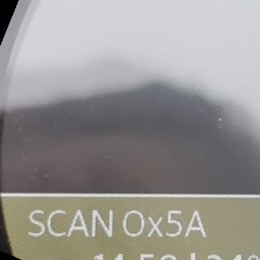 |
| `0x5B` | ✅ | TBD | 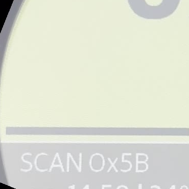 |
| `0x5C` | ✅ | TBD | 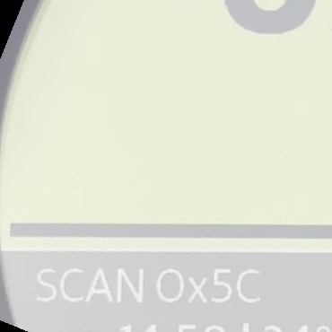 |
| `0x5D` | ✅ | TBD | 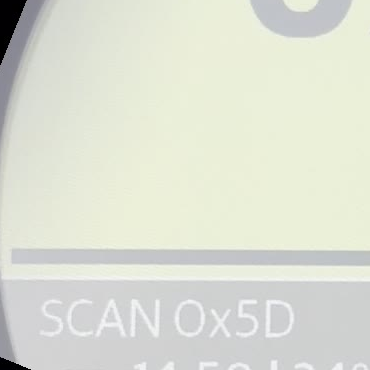 |
| `0x5E` | ✅ | TBD | 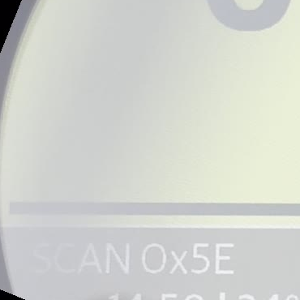 |
| `0x5F` | 🟡 | TBD | 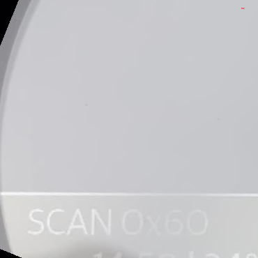 |
| `0x60` | 🟡 | TBD | 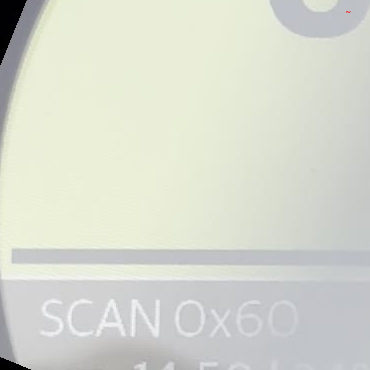 |
| `0x61` | 🟡 | TBD | 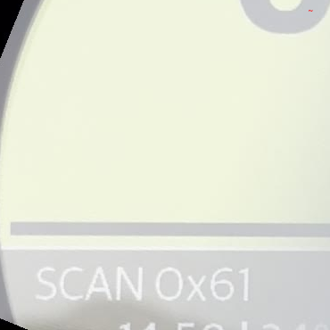 |
| `0x62` | ✅ | TBD | 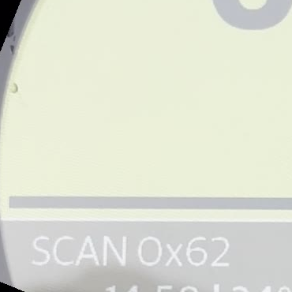 |
| `0x63` | ✅ | TBD | 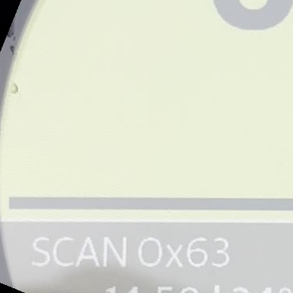 |
| `0x64` | ✅ | TBD | 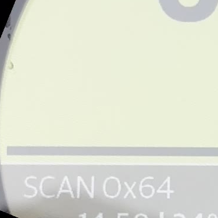 |
| `0x65` | ✅ | TBD | 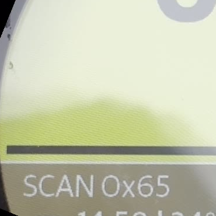 |
| `0x66` | ✅ | TBD | 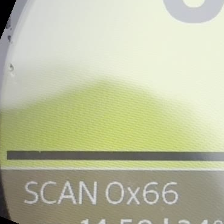 |
| `0x67` | ✅ | TBD | 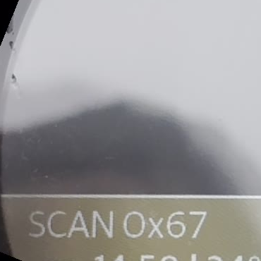 |
| `0x68` | 🟡 | TBD | 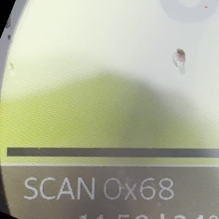 |
| `0x69` | ✅ | TBD | 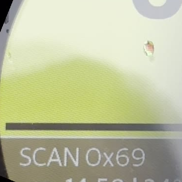 |
| `0x6A` | ✅ | TBD | 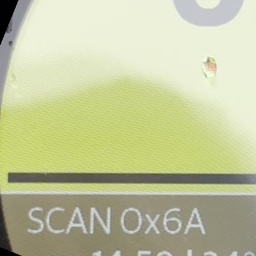 |
| `0x6B` | ✅ | TBD | 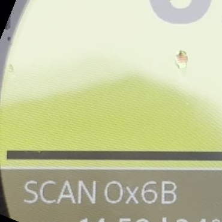 |
| `0x6C` | ✅ | TBD | 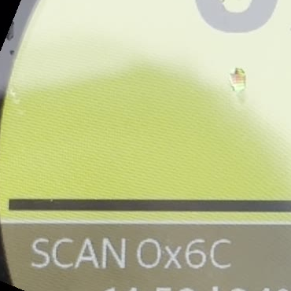 |
| `0x6D` | ✅ | TBD | 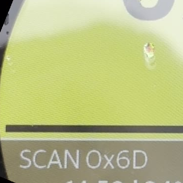 |
| `0x6E` | ✅ | TBD | 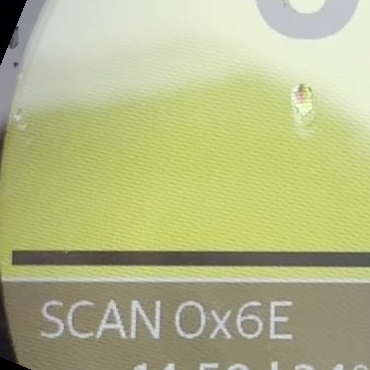 |
| `0x6F` | ✅ | TBD | 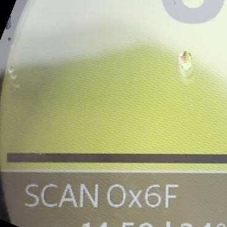 |
| `0x70` | ✅ | TBD | 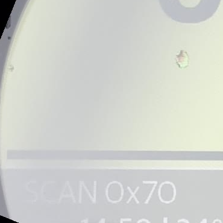 |
| `0x71` | 🟡 | TBD | 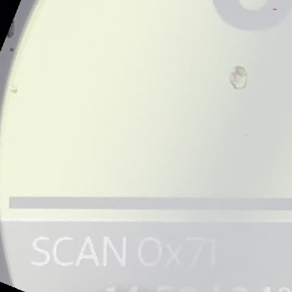 |
| `0x72` | ✅ | TBD | 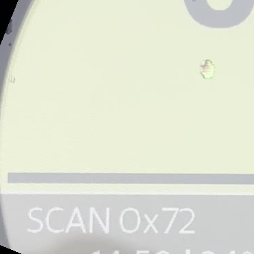 |
| `0x73` | ✅ | TBD | 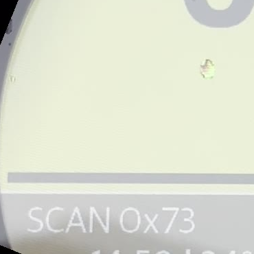 |
| `0x74` | 🟡 | TBD | 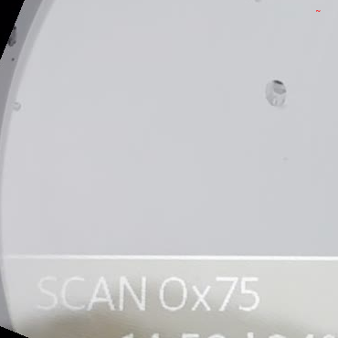 |
| `0x75` | 🟡 | TBD | 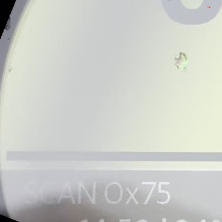 |
| `0x76` | 🟡 | TBD | 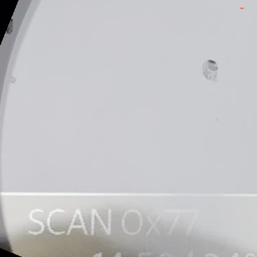 |
| `0x77` | 🟡 | TBD | 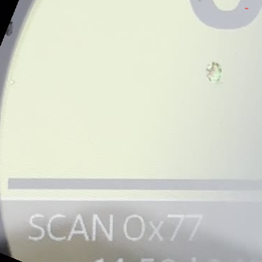 |
| `0x78` | 🟡 | TBD | 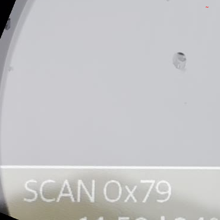 |
| `0x79` | 🟡 | TBD | 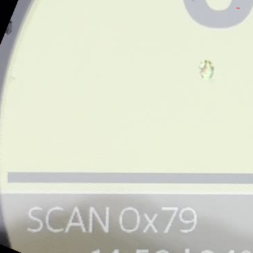 |
| `0x7A` | ✅ | TBD | 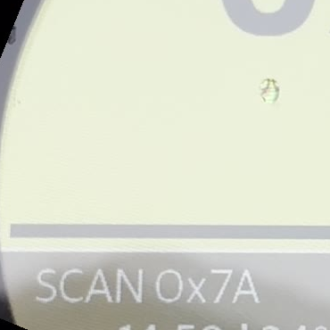 |
| `0x7B` | ✅ | TBD | 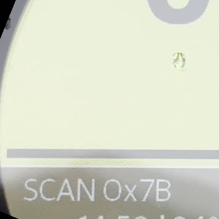 |
| `0x7C` | ✅ | TBD | 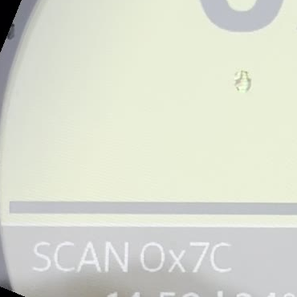 |
| `0x7D` | 🟡 | TBD | 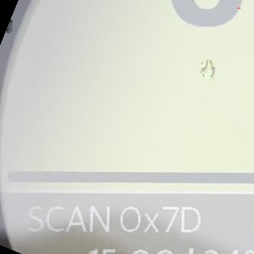 |
| `0x7E` | 🟡 | TBD | 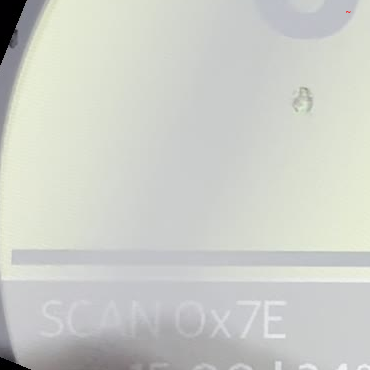 |
| `0x7F` | 🟡 | TBD | 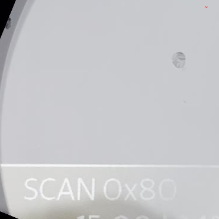 |
| `0x80` | ✅ | TBD | 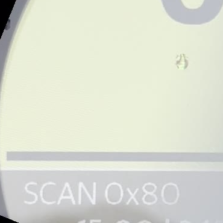 |
| `0x81` | ✅ | TBD | 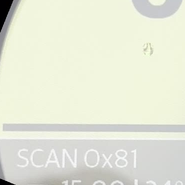 |
| `0x82`..`0xFF` | ⚫ hidden | **Hidden bubble** — overlay fully suppressed (every byte in range, field-verified) | — |

## How to regenerate

```bash
# 1. Run scanner mode on phone via ManeuverScannerLoop with holdSeconds=5.
# 2. Mount Tripper, ride briefly, switch to "Active Nav (Scan)" mode.
# 3. Record video of the dash (selfie stick + 1080p phone camera works
#    better than the in-app UDP recorder for visual clarity).
# 4. Crop video to dash + rotate so the SCAN text is horizontal:

ffmpeg -i SCAN_VIDEO.mov \
  -vf "rotate=22*PI/180:ow=rotw(22*PI/180):oh=roth(22*PI/180):c=black,fps=0.5" \
  -q:v 3 frames/f_%03d.jpg

# 5. Extract bubble + SCAN label region for each frame (self-labeling):
#    crop = (100, 460, 470, 830)  →  370×370 px
#    bubble visible at top, "100 m" beneath, "SCAN 0xNN" along the bottom.

# 6. OCR the SCAN label to get the ground-truth byte for each frame,
#    then map first-occurrence frame → byte for the catalog file name.

# 7. For bytes without an OCR anchor, linearly interpolate between
#    neighbouring anchors and flag the entry as 🟡 interpolated.

# 8. Verify each glyph by reading the SCAN label inside the PNG itself.
```

## Open questions / pending work

- [ ] **Re-classify `0x02..0x81`**: row-by-row labelling based on the
      self-labeled glyph image; the earlier text descriptions were
      derived from misaligned timing-based mapping and have been removed
- [ ] **Re-verify `0x03..0x04`**: legacy "Y-fork stay-left / stay-right"
      labels were derived under the old (misaligned) mapping — verify
      against scan2 frame and against a controlled field run on a real
      fork
- [ ] **Direction-bit hypothesis** (was raised under earlier mapping):
      whether bits 7..4 control rotation direction for roundabouts —
      drop and re-derive after re-classification
- [ ] **Non-visual side effects in `0x82..0xFF`**: bubble is suppressed,
      but does any byte in that range still trigger non-visual effects
      (beep, text bar, vibration)? — needs separate test

## See also

- [`ManeuverScannerLoop.swift`](../../TripperDashPP/Navigation/ManeuverScannerLoop.swift) — Scanner implementation (walks `0x00..0xFF`, burns `SCAN 0xNN` label into the video stream)
- [`ManeuverScanSource.swift`](../../TripperDashPP/Stream/ManeuverScanSource.swift) — Video overlay that burns the ground-truth label
- [`ManeuverIcon.swift`](../../TripperDashPP/Navigation/Models/ManeuverIcon.swift) — Asset-free glyph renderer for the phone-side burned arrow (used when the dash enum is untrusted)
- [Overview grid (all 130 captured)](all-glyphs-overview.jpg)
