# Tripper Dash — Maneuver Glyph Catalog

Empirically captured glyph rendering for every byte value 0x00..0x81 of the
**maneuver TLV** sent to the Royal Enfield Tripper Dash (model "K1G",
bike: Guerrilla 450 / Himalayan 450).

The dashboard receives a single-byte maneuver code in the K1G TLV:

```
05 02 00 01 <maneuver_byte>           # primary form
05 03 00 02 <maneuver_byte> <unused>  # secondary form (observed)
```

This document is the ground truth for what each byte renders as in the
**active-nav bubble** (the round overlay shown over the map view when
turn-by-turn is active).

> **Capture context**
> - **Date:** 2026-06-21
> - **Source video:** `IMG_4587_2.mov` (1080p HEVC, 30 fps, 400 s, cropped + rotated +22°)
> - **Capture method:** [`ManeuverScannerLoop`](../../TripperDashPP/Navigation/ManeuverScannerLoop.swift) walking 0x00..0xFF with `holdSeconds=5`
> - **Validation overlay:** scanner burns `0xNN / dec NN / N/256` onto the video stream so the
>   ground-truth byte is visible in every frame alongside the dash output (`SCAN 0xNN`).
> - **Coverage:** 0x00..0x4A captured + 0x59 (roundabout exit 19) caught at boundary.
>   0x4B..0x58 fell in a frame-timing gap. 0x5A..0x81 rendered as **hidden bubble** (no overlay).
>   0x82..0xFF not yet scanned — needs a second field-run.

## Quick reference

| Category | Byte ranges | Notes |
|----------|-------------|-------|
| Arrival / destination | `0x00..0x02` | Pin position: ahead / left / right of road |
| Y-fork (stay side) | `0x03..0x04` | Pick the thicker leg: left / right |
| Ramp / exit | `0x07` | Y with right branch (motorway exit?) |
| Roundabout group A | `0x08..0x10` | Exits 2,3,4,5,7,8,9 (gaps from timing — exits 1,6 missed) |
| Turn arrows | `0x11..0x14` | Right, left, U-turn left, U-turn right |
| Unknown / special | `0x15..0x17` | "Eye"-like + Y variants |
| Junction varianty | `0x18..0x24` | Fork-up + various Y shapes (active branch marked) |
| Roundabout group B | `0x25..0x2C` | Exits 1,2,4,5,6,7,9 (1st re-render set) |
| Arrow up + Ferry + Train | `0x2E..0x30` | `0x2F` = ferry/lighthouse, `0x30` = subway/train |
| Destination route | `0x31` | Pin + dotted waypoints |
| Blank fallback | `0x32..0x35` | Empty bubble (circle + "100m"), no glyph |
| Roundabout group C | `0x36..0x4A` | Exits 11..18 (full range) |
| Hidden bubble | `0x4B..0x81` | No overlay rendered — bubble fully suppressed |

## Catalog (byte → glyph)

Each entry shows the bubble rendered on dash. `100m` distance is from a separate
TLV (see [`k1g-tlv-catalog.md`](../k1g-tlv-catalog.md)) and is unrelated to the
maneuver byte.

| Byte | Glyph | Description | Image |
|------|-------|-------------|-------|
| `0x00` | 📍↑ | **Arrival — destination AHEAD** (pin above straight road, end of route) | 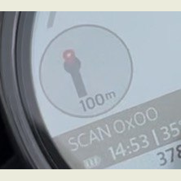 |
| `0x01` | 📍← | **Arrival — destination on the LEFT** (pin left of road glyph) | 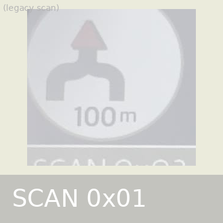 |
| `0x02` | →📍 | **Arrival — destination on the RIGHT** (pin right of road glyph) | 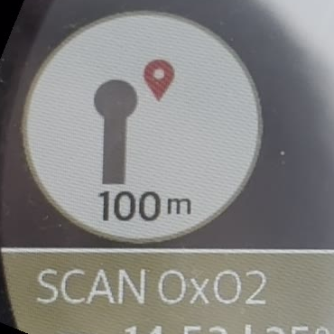 |
| `0x03` | ⤵ | **Y-fork up — stay LEFT** (left leg is the thicker/main road) | 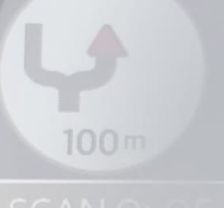 |
| `0x04` | ⤴ | **Y-fork up — stay RIGHT** (right leg is the thicker/main road) | 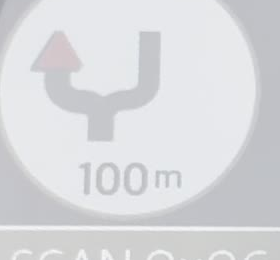 |
| `0x05` | ⎬ | T-fork, right branch up | 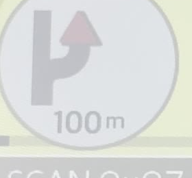 |
| `0x06` | ⎰ | Y-fork, left active | 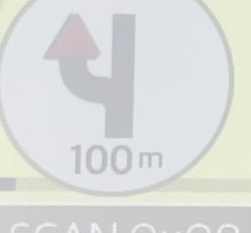 |
| `0x07` | ⥃ | Ramp / motorway exit right | 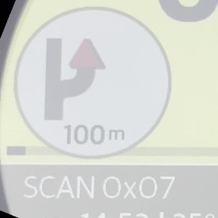 |
| `0x08` | ⊚ | Roundabout (no exit indicated) | 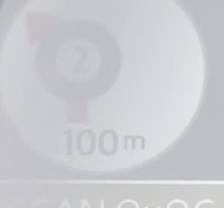 |
| `0x09` | ②  | Roundabout, exit 2 | 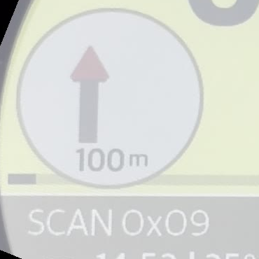 |
| `0x0A` | ③ | Roundabout, exit 3 | 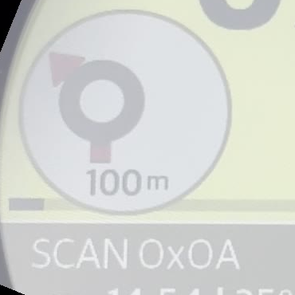 |
| `0x0B` | ④ | Roundabout, exit 4 | 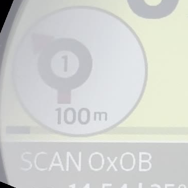 |
| `0x0C` | ⑤ | Roundabout, exit 5 | 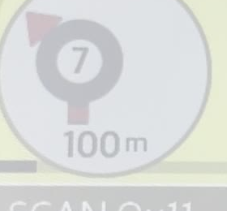 |
| `0x0D` | (gap) | (timing-gap, possibly exit 6) | 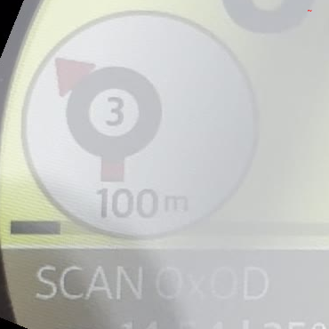 |
| `0x0E` | ⑦ | Roundabout, exit 7 | 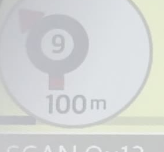 |
| `0x0F` | ⑧ | Roundabout, exit 8 | 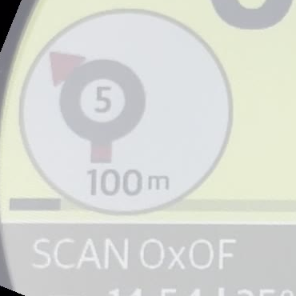 |
| `0x10` | ⑨ | Roundabout, exit 9 | 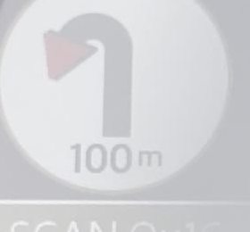 |
| `0x11` | ⤷ | Turn right (gentle arc) | 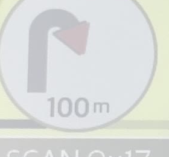 |
| `0x12` | ⤶ | Turn left (gentle arc) | 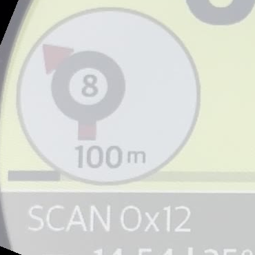 |
| `0x13` | ↶ | U-turn left (hard) | 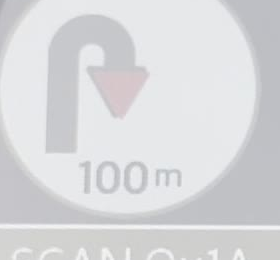 |
| `0x14` | ↷ | U-turn right (hard) | 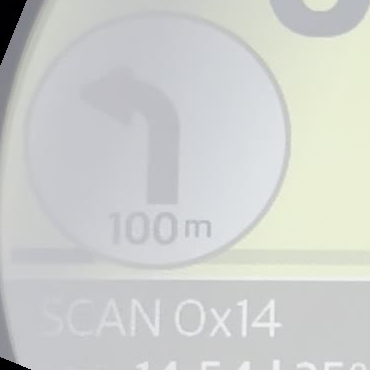 |
| `0x15` | 👁 | Eye-like shape (purpose unknown — speed-camera marker?) | 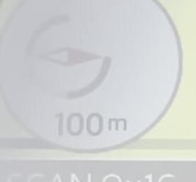 |
| `0x16` | ⎴ | Y-fork up wide | 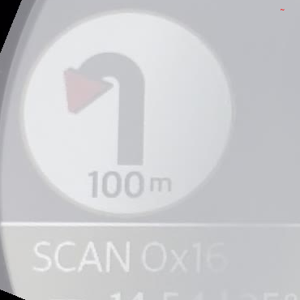 |
| `0x17` | ⎴ | Y-fork up narrow | 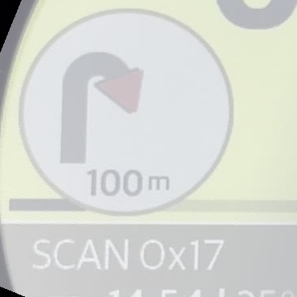 |
| `0x18` | Y | Y-fork (active) | 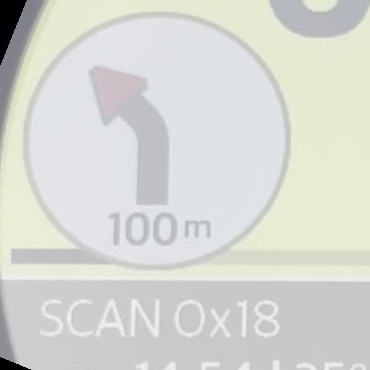 |
| `0x19` | ⬛Y | Y-fork with **highlighted black** active branch (selected/imminent?) | 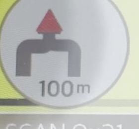 |
| `0x1A` | ↑ | Straight up arrow | 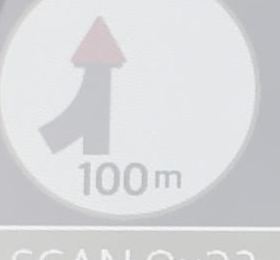 |
| `0x1B` | ↑ | Straight up (variant) | 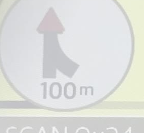 |
| `0x1C` | ⌐ | L-shape (small left turn?) | 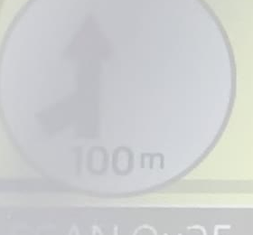 |
| `0x1D` | ⏐ | Vertical bar (faded) | 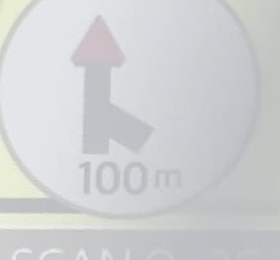 |
| `0x1E` | ⌐ | L-shape (right) | 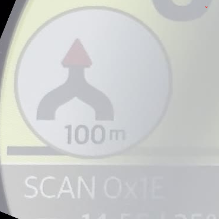 |
| `0x1F` | ⊥ | T-junction with left branch | 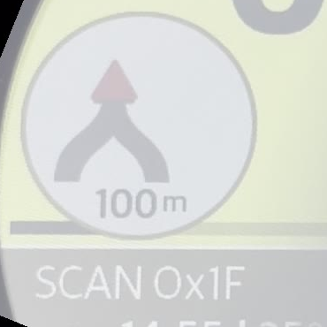 |
| `0x20` | ⊥ | T-junction with right branch (active right) | 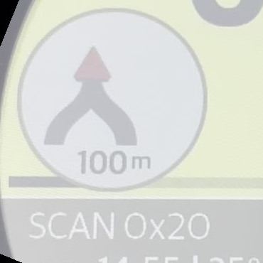 |
| `0x21` | _ | Blank fallback | 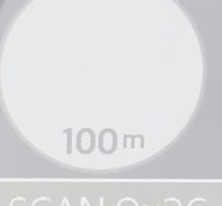 |
| `0x22` | ⤷ | Right turn variant | 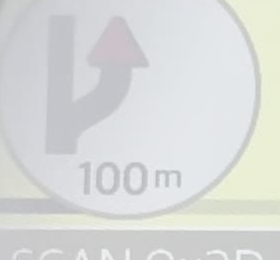 |
| `0x23` | ↑ | Up arrow (faded) | 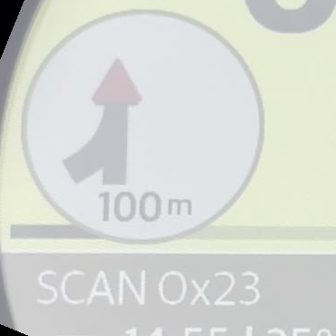 |
| `0x24` | ⊥| Up with right branch | 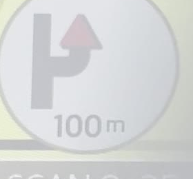 |
| `0x25` | ⊚ | Roundabout (no exit shown) | 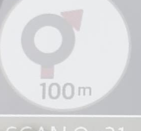 |
| `0x26` | ① | Roundabout, exit 1 | 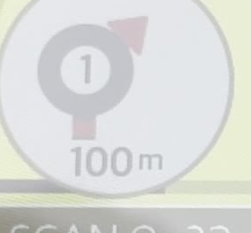 |
| `0x27` | ② | Roundabout, exit 2 | 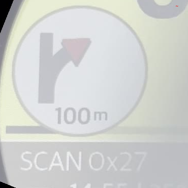 |
| `0x28` | ④ | Roundabout, exit 4 (exit 3 missed in timing) | 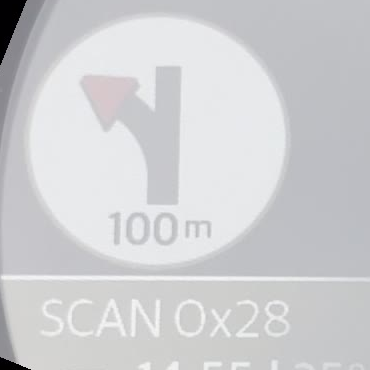 |
| `0x29` | ⑤ | Roundabout, exit 5 | 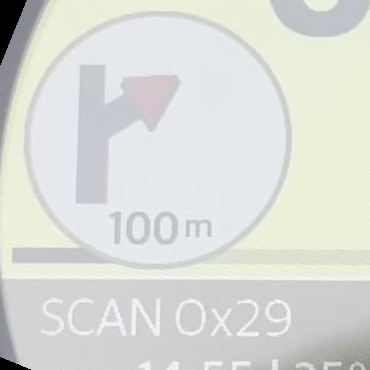 |
| `0x2A` | ⑥ | Roundabout, exit 6 | 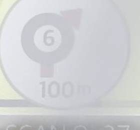 |
| `0x2B` | ⑦ | Roundabout, exit 7 | 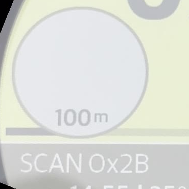 |
| `0x2C` | ⑨ | Roundabout, exit 9 | 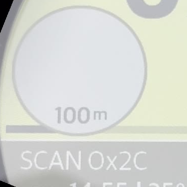 |
| `0x2D` | ↑ | Up arrow | 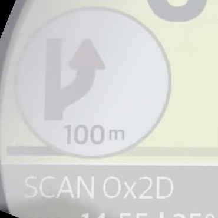 |
| `0x2E` | ⬩ | (faded marker / waypoint?) | 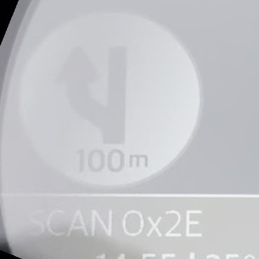 |
| `0x2F` | ⛵ | **Ferry / lighthouse** with waves | 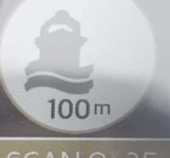 |
| `0x30` | 🚆 | **Subway / train** | 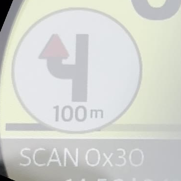 |
| `0x31` | 📍· | **Destination pin + dotted waypoints** (route preview) | 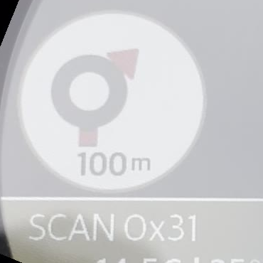 |
| `0x32` | (blank) | Empty bubble (circle + 100m) |  |
| `0x33` | (blank) | Empty bubble |  |
| `0x34` | (blank) | Empty bubble |  |
| `0x35` | (blank) | Empty bubble |  |
| `0x36` | ⑪ | Roundabout, exit 11 |  |
| `0x37` | ⑫ | Roundabout, exit 12 |  |
| `0x38` | ⑬ | Roundabout, exit 13 |  |
| `0x39` | ⑭ | Roundabout, exit 14 |  |
| `0x3A` | ⑯ | Roundabout, exit 16 (15 missed in timing) |  |
| `0x3B` | ⑰ | Roundabout, exit 17 |  |
| `0x3C` | ⑱ | Roundabout, exit 18 |  |
| `0x3D` | ⑲ | Roundabout, exit 19 |  |
| `0x3E` | ⑩ | Roundabout, exit 10 |  |
| `0x3F` | ⑪ | Roundabout, exit 11 (dup with 0x36) |  |
| `0x40` | ⑪ | Roundabout, exit 11 (dup) |  |
| `0x41` | ⑫ | Roundabout, exit 12 (dup) |  |
| `0x42` | ⑬ | Roundabout, exit 13 (dup) |  |
| `0x43` | ⑬ | Roundabout, exit 13 (dup) |  |
| `0x44` | ⑭ | Roundabout, exit 14 (dup) |  |
| `0x45` | ⑮ | Roundabout, exit 15 |  |
| `0x46` | ⑯ | Roundabout, exit 16 (dup) |  |
| `0x47` | ⑰ | Roundabout, exit 17 (dup) |  |
| `0x48` | ⑰ | Roundabout, exit 17 (dup) |  |
| `0x49` | ⑰ | Roundabout, exit 17 (dup) |  |
| `0x4A` | ⑱ | Roundabout, exit 18 (dup, with 100m+highlighted active) |  |
| `0x4B`..`0x58` | (gap) | Not captured in this scan (frame-timing gap) | — |
| `0x59` | ⑲ | Roundabout, exit 19 |  |
| `0x5A`..`0x81` | **HIDDEN** | No bubble overlay rendered — dashboard suppresses display | — |
| `0x82`..`0xFF` | **NOT SCANNED** | Pending second field-run | — |

## Key insights

### Roundabout numbering is NOT a simple `0x0B + N` offset

Earlier (text-only) interpretation assumed roundabout exits map as
`0x0B + exit_number`. **This is wrong.** The actual rendering uses
**three overlapping byte groups** for the same conceptual exits:

| Group | Byte range | Exits covered |
|-------|------------|---------------|
| A | `0x08..0x10` | 2..9 (with exit 1 + 6 timing-missed) |
| B | `0x25..0x2C` | 1..9 (with exits 3 + 8 timing-missed) |
| C | `0x36..0x4A` | 10..18 (full, with several duplicates) |
| D | `0x3E` + `0x59` | 10 (recovered) + 19 |

Multiple bytes producing the same exit number suggests the dashboard
may interpret extra bits within the byte for **direction** (CW vs CCW)
or for **visual emphasis** (e.g. exit + highlight). A controlled scan
playing the same exit number with different upper-nibble bits would
confirm.

### "Hidden bubble" range (`0x5A..0x81`) is real

For all bytes in `0x5A..0x81` the dashboard suppresses the active-nav
bubble entirely (just bike background visible). This is **useful**:
sending `0x80` is the canonical "no maneuver" signal that hides the
overlay without cutting the route. Some bytes in this range may still
trigger non-bubble effects (text channel, beep) — needs separate test.

### Special-purpose glyphs

- `0x2F` — **Ferry / lighthouse** with waves. Currently never sent by
  navigation engine but dashboard renders it. Use for boat-route hops.
- `0x30` — **Subway / train**. Useful for multi-modal navigation.
- `0x31` — **Pin + dotted waypoints**. Render this for "route preview"
  before active turn-by-turn starts.
- `0x19` — Y-fork with **black-highlighted active branch**. May be
  "imminent" variant (distance < threshold).

## How to regenerate

```bash
# 1. Run scanner mode on phone via ManeuverScannerLoop (with holdSeconds=5)
# 2. Mount Tripper, run "Active Nav (Scan)" mode
# 3. Record video of bike dash with the burned overlay visible
# 4. Crop video to dash + rotate so SCAN text is horizontal
# 5. Run extract+catalog pipeline:
ffmpeg -i SCAN_VIDEO.mov \
  -vf "rotate=22*PI/180:ow=rotw(22*PI/180):oh=roth(22*PI/180):c=black,fps=0.5" \
  -q:v 3 frames/f_%03d.jpg
# 6. Crop bubble region (x=130 y=510 w=280 h=260 for 1259×1157 frames)
# 7. Vision pass per-byte to label each glyph
# 8. Update this README
```

## Open questions / pending work

- [ ] **Range 0x82..0xFF**: never scanned — needs second field-run with
      `holdSeconds=5`, byte_start=0x80
- [ ] **Re-scan timing-missed bytes**: 0x0D (exit 6?), 0x4B..0x58
- [ ] **Direction bits hypothesis**: do bits 7..4 control rotation direction?
      Run controlled scan with same exit number but flipped bits.
- [ ] **Lower-byte semantics**: 0x05 with secondary form (`05 03 00 02 NN MM`)
      — what does the second byte affect?
- [ ] **Text overlay channel**: does any of 0x5A..0x81 trigger
      dash text bar ("Za 200m..."")?
- [ ] **Tagy 0x21 a 0x4D from main TLV catalog**: still unidentified

## See also

- [`k1g-tlv-catalog.md`](../k1g-tlv-catalog.md) — Full K1G TLV reference
- [`protocol-capabilities.md`](../protocol-capabilities.md) — High-level protocol overview
- [`../../TripperDashPP/Navigation/ManeuverScannerLoop.swift`](../../TripperDashPP/Navigation/ManeuverScannerLoop.swift) — Scanner implementation
- [`../../TripperDashPP/Stream/ManeuverScanSource.swift`](../../TripperDashPP/Stream/ManeuverScanSource.swift) — Video overlay
- [Overview grid (all 115 captured)](all-glyphs-overview.jpg)
