# Tripper Dash — Maneuver Glyph Catalog

Empirical glyph rendering for every byte value `0x00..0x81` of the
**maneuver TLV** sent to the Royal Enfield Tripper Dash (model "K1G",
bike: Guerrilla 450 / Himalayan 450).

The dashboard receives a single-byte maneuver code in the K1G TLV:

```
05 02 00 01 <maneuver_byte>           # primary form
05 03 00 02 <maneuver_byte> <unused>  # secondary form (observed)
```

This document is the ground truth for what each byte renders as in the
**active-nav bubble** (the round overlay shown over the map view when
turn-by-turn is active).

## Capture context

- **Date**: 2026-06-21
- **Source video**: `IMG_4587_2.mov` (1080p HEVC, 30 fps, 400 s, rotated +22° CW)
- **Capture method**: [`ManeuverScannerLoop`](../../TripperDashPP/Navigation/ManeuverScannerLoop.swift)
  walks `0x00..0xFF` with `holdSeconds=5`. The phone sends
  `primaryManeuver: byte` together with `roadName: "SCAN 0xNN"` for the
  **same** byte — see [`ManeuverScannerLoop.swift#sendNavPacket`](../../TripperDashPP/Navigation/ManeuverScannerLoop.swift#L183). The dash renders both: the active-nav bubble on
  the left, and the burned "SCAN 0xNN" label at the bottom. **The
  burned label is the authoritative ground truth.**
- **Coverage**: `0x00..0xFF` (full 8-bit range). Bytes `0x00..0x59` produce
  visible bubble glyphs (90 distinct entries captured). Bytes
  `0x5A..0xFF` are **hidden bubble** — overlay fully suppressed for
  every byte in range, field-verified byte-by-byte.
- **Extraction**: each glyph crop is **self-labeled** — the SCAN text under the
  bubble appears in every PNG so you can verify the byte → glyph mapping
  by eye without trusting any external mapping.

## Glyph index status

The catalog re-build on 2026-06-21 replaced the earlier timing-based
mapping (which was misaligned) with **OCR-anchored** mapping that reads
the burned SCAN label directly:

| Status | Count | Meaning |
|--------|-------|---------|
| ✅ **anchor** | ~55 | OCR of the SCAN label parsed cleanly — image and label match |
| 🟡 **interpolated** | ~32 | OCR missed in that frame, image picked by linear interp between neighbouring anchors — verify against the SCAN label visible inside the PNG |
| 📸 **user photo** | 3 | `0x00`, `0x01`, `0x04` captured directly from dash via phone photo (user-supplied, SCAN label visible) |
| ⚫ **hidden bubble** | 166 | `0x5A..0xFF` — dash renders nothing (overlay fully suppressed), field-verified byte-by-byte |

A glyph marked **interpolated** is still a real bubble frame from the
video — the OCR just couldn't read the label cleanly in that specific
frame. The SCAN label inside the PNG is the ground truth; if it doesn't
match the row's byte, the row is misaligned and needs re-extraction.

## Quick reference (user-confirmed; rest pending re-classification)

| Byte | Glyph | Description |
|------|-------|-------------|
| `0x00` | 📍↑ | **Arrival** — destination AHEAD (user-photo) |
| `0x01` | 📍↖ | **Arrival** — destination ahead-LEFT (user-photo) |
| `0x02` | 📍↗ | **Arrival** — destination ahead-RIGHT |
| `0x03` | T📍↗ | **Arrival at T-junction** — destination ahead-RIGHT |
| `0x04` | T📍↖ | **Arrival at T-junction** — destination ahead-LEFT (user-photo) |
| `0x05`..`0x08` | ↰Y / ↱Y | **Y-fork** — stay LEFT (0x05–0x06) / stay RIGHT (0x07–0x08) |
| `0x09` | ↑ | **Continue straight** |
| `0x0A`..`0x13` | ⟳0..⟳9 | **Roundabout CW** — exit numbers 0..9 (small style) |
| `0x14`..`0x15` | ↰ / ↱ | **Turn LEFT / RIGHT** (90°) |
| `0x16`..`0x17` | ⤴ / ⤵ | **Sharp LEFT / RIGHT** (>90° hairpin) |
| `0x18`..`0x19` | ↖ / ↗ | **Slight LEFT / RIGHT** |
| `0x1A` / `0x1C` | ↺ / ↻ | **U-turn LEFT / RIGHT** (180°) |
| `0x1B`, `0x1D`..`0x20` | Y↑ | **Y-fork — continue straight** (centre arrow between legs) |
| `0x21`..`0x22` | ⊤↑ | **T-junction — continue straight across** |
| `0x23`..`0x25` | ⊤↱ | **T-junction — turn RIGHT** (variants; 0x25 faded) |
| `0x26` | ┃↑ | **Cross-roads — continue straight** |
| `0x27`, `0x2A` | ┳↰ | **Side-road LEFT** — turn left onto side road |
| `0x28`, `0x29` | ┳↱ | **Side-road RIGHT** — turn right onto side road |
| `0x2D`..`0x2E` | ┳↗ / ┳↖ | **Side-road slight RIGHT / LEFT** |
| `0x2F`..`0x30` | ┻↱ / ┻↰ | **Side-road merge from RIGHT / LEFT** |
| `0x31`..`0x3A` | ⟳0..⟳9 | **Roundabout CW** — exit numbers 0..9 (large style) |
| `0x3B` | ↑ | **Continue straight (long-distance)** |
| `0x3C` | 📍 | **Arrival pin** — destination marker only |
| `0x3D` | ⤺ | **U-turn at next junction** |
| `0x3E` | ⛴ | **Ferry crossing** |
| `0x3F` | 🚆 | **Train / level crossing** |
| `0x40` | 📍… | **Arrival approaching** (pin with dotted trail) |
| `0x42` | 📶 | **Signal / Wi-Fi indicator** (purpose unclear — info icon?) |
| `0x46`..`0x4F` | ⟳10..⟳19 | **Roundabout CW** — exit numbers 10..19 |
| `0x50`..`0x59` | ⟲10..⟲19 | **Roundabout CCW** — exit numbers 10..19 (left-hand-traffic style) |
| `0x2B`, `0x2C`, `0x41`, `0x43`..`0x45` | ⚪ | **Empty bubble** — no glyph rendered (placeholders inside visible range) |
| `0x5A`..`0xFF` | ⚫ hidden | **Hidden bubble** — overlay fully suppressed (useful as "no maneuver" signal) |

> **Note**: descriptions for `0x05..0x59` were derived from visual
> inspection of the bubble glyph in each PNG (no SDK / firmware
> docs). Treat them as best-guess from the bubble shape — verify
> by sending the byte to the dash before relying on it in a route.

## How to send a custom maneuver

The dash will render any glyph code you send. From phone-side code:

```swift
// Send single primary maneuver:
await link.sendActiveNav(
    primaryManeuver: 0x33,                    // any byte 0x00..0x59 from catalog
    primaryDistanceMeters: 200,
    primaryUnit: 0x30,                         // 0x30 = metres
    totalDistanceMeters: 1200,
    totalDistanceUnit: 0x30,
    useCommaDecimal: false,
    decimalFmtOn: false,
    roadName: "Main St",
    eta: Date(timeIntervalSinceNow: 600),
    is24Hour: true,
    remainingSeconds: nil
)
```

Bytes in `0x5A..0xFF` suppress the active-nav overlay completely.
Use `0xFF` (or any byte in that range) as the canonical "no maneuver"
signal that hides the bubble without tearing down the route.

## Catalog (byte → glyph)

Each entry shows the bubble captured from the dash. The `100m` distance
under the symbol comes from a separate TLV (the K1G `05 02 / 05 03`
maneuver block) and is unrelated to the maneuver byte. Every captured
PNG includes the burned `SCAN 0xNN` label at the bottom for
self-verification.

Legend: ✅ = anchor (OCR-confirmed), 🟡 = interpolated, 🔄 = legacy.

| Byte | Source | Description | Image |
|------|--------|-------------|-------|
| `0x00` | 📸 user photo | **Arrival — destination AHEAD** (pin directly above straight arrow, end of route, user-confirmed) |  |
| `0x01` | 📸 user photo | **Arrival — destination ahead, slightly LEFT of route** (pin top-left + straight arrow, user-confirmed) |  |
| `0x02` | ✅ 📍↑→ | **Arrival — destination ahead-RIGHT** (mirror of 0x01: pin top-right + straight arrow) |  |
| `0x03` | ✅ 📍T→ | **Arrival at T-junction — destination ahead-RIGHT** (mirror of 0x04: T-shape with pin top-right) |  |
| `0x04` | 📸 user photo | **Arrival at T-junction — destination ahead-LEFT of the T** (thick vertical shaft branching left+right, red pin top-left above the split, user-confirmed) |  |
| `0x05` | 🟡 ↰Y | **Y-fork — stay LEFT** (pin top-left + Y-shape, left leg highlighted) |  |
| `0x06` | ✅ ↰Y | **Y-fork — stay LEFT** (variant; left leg highlighted) |  |
| `0x07` | ✅ ↱Y | **Y-fork — stay RIGHT** (right leg highlighted) |  |
| `0x08` | ✅ ↱Y | **Y-fork — stay RIGHT** (variant; right leg highlighted) |  |
| `0x09` | 🟡 ↑ | **Continue straight** (straight arrow, no junction) |  |
| `0x0A` | ✅ ⟳0 | **Roundabout CW — exit 0** (entry indicator / no specific exit) |  |
| `0x0B` | ✅ ⟳1 | **Roundabout CW — take exit 1** |  |
| `0x0C` | 🟡 ⟳2 | **Roundabout CW — take exit 2** |  |
| `0x0D` | 🟡 ⟳3 | **Roundabout CW — take exit 3** |  |
| `0x0E` | ✅ ⟳4 | **Roundabout CW — take exit 4** |  |
| `0x0F` | ✅ ⟳5 | **Roundabout CW — take exit 5** |  |
| `0x10` | ✅ ⟳6 | **Roundabout CW — take exit 6** |  |
| `0x11` | 🟡 ⟳7 | **Roundabout CW — take exit 7** |  |
| `0x12` | ✅ ⟳8 | **Roundabout CW — take exit 8** |  |
| `0x13` | ✅ ⟳9 | **Roundabout CW — take exit 9** |  |
| `0x14` | ✅ ↰ | **Turn LEFT** (90° left, L-shape) |  |
| `0x15` | 🟡 ↱ | **Turn RIGHT** (90° right, L-shape, mirror of 0x14) |  |
| `0x16` | 🟡 ⤴ | **Sharp LEFT** (>90° hairpin to the left) |  |
| `0x17` | ✅ ⤵ | **Sharp RIGHT** (>90° hairpin to the right, mirror of 0x16) |  |
| `0x18` | ✅ ↖ | **Slight LEFT** (shallow left curve) |  |
| `0x19` | ✅ ↗ | **Slight RIGHT** (shallow right curve, mirror of 0x18) |  |
| `0x1A` | 🟡 ↺ | **U-turn LEFT** (180° via left side) |  |
| `0x1B` | ✅ Y↑ | **Y-fork — continue straight** (arrow up the centre between the two legs) |  |
| `0x1C` | ✅ ↻? | **U-turn RIGHT** (180° via right side, mirror of 0x1A — image partly obscured) |  |
| `0x1D` | 🟡 Y↑ | **Y-fork — continue straight** (variant of 0x1B) |  |
| `0x1E` | 🟡 Y↑ | **Y-fork — continue straight** (variant) |  |
| `0x1F` | ✅ Y↑ | **Y-fork — continue straight** (variant) |  |
| `0x20` | ✅ Y↑ | **Y-fork — continue straight** (wider Y) |  |
| `0x21` | ✅ ⊤↑ | **T-junction — continue straight across** (cross the T; arrow continues forward) |  |
| `0x22` | 🟡 ⊤↑ | **T-junction — continue straight across** (variant of 0x21) |  |
| `0x23` | ✅ ⊤↱ | **T-junction — turn RIGHT** (right branch highlighted) |  |
| `0x24` | ✅ ⊤↱ | **T-junction — turn RIGHT** (variant) |  |
| `0x25` | ✅ ⊤? | **T-junction variant** — image very faded, classification tentative |  |
| `0x26` | 🟡 ┃↑ | **Cross-roads — continue straight** (vertical road, arrow forward) |  |
| `0x27` | 🟡 ┳↰ | **Side-road LEFT — turn LEFT onto side road** (main road continues straight, left turn taken) |  |
| `0x28` | ✅ ┳↱ | **Side-road RIGHT — turn RIGHT onto side road** |  |
| `0x29` | ✅ ┳↱ | **Side-road RIGHT — turn RIGHT onto side road** (variant) |  |
| `0x2A` | ✅ ┳↰ | **Side-road LEFT — turn LEFT onto side road** (variant) |  |
| `0x2B` | ✅ ⚪ | **Empty bubble (no glyph rendered)** — likely placeholder/unused code |  |
| `0x2C` | ✅ ⚪ | **Empty bubble (no glyph rendered)** — likely placeholder/unused code |  |
| `0x2D` | ✅ ┳↗ | **Side-road RIGHT — slight RIGHT onto side road** |  |
| `0x2E` | ✅ ┳↖ | **Side-road LEFT — slight LEFT onto side road** (mirror of 0x2D) |  |
| `0x2F` | 🟡 ┻↱ | **Side-road from RIGHT — merge then turn RIGHT** |  |
| `0x30` | ✅ ┻↰ | **Side-road from LEFT — merge then turn LEFT** |  |
| `0x31` | ✅ ⟳0 | **Roundabout CW — exit 0** (large style; entry indicator) |  |
| `0x32` | 🟡 ⟳1 | **Roundabout CW — take exit 1** (large style) |  |
| `0x33` | 🟡 ⟳2 | **Roundabout CW — take exit 2** (large style) |  |
| `0x34` | 🟡 ⟳3 | **Roundabout CW — take exit 3** (large style) |  |
| `0x35` | 🟡 ⟳4 | **Roundabout CW — take exit 4** (large style) |  |
| `0x36` | 🟡 ⟳5 | **Roundabout CW — take exit 5** (large style) |  |
| `0x37` | 🟡 ⟳6 | **Roundabout CW — take exit 6** (large style) |  |
| `0x38` | 🟡 ⟳7 | **Roundabout CW — take exit 7** (large style) |  |
| `0x39` | ✅ ⟳8 | **Roundabout CW — take exit 8** (large style) |  |
| `0x3A` | ✅ ⟳9 | **Roundabout CW — take exit 9** (large style) |  |
| `0x3B` | ✅ ↑ | **Continue straight (long-distance)** (tall straight arrow) |  |
| `0x3C` | 🟡 📍 | **Arrival pin (destination marker only)** — no arrow |  |
| `0x3D` | 🟡 ⤺ | **U-turn at the next junction** (curved 180° arrow) |  |
| `0x3E` | ✅ ⛴ | **Ferry crossing** — board ferry / waterway |  |
| `0x3F` | ✅ 🚆 | **Train / level crossing** — railway |  |
| `0x40` | ✅ 📍… | **Arrival approaching** (pin with dotted trail — destination near) |  |
| `0x41` | ✅ ⚪ | **Empty bubble (no glyph rendered)** — likely placeholder/unused code |  |
| `0x42` | ✅ 📶 | **Signal / Wi-Fi-style indicator** — purpose unclear (info icon? GPS-signal state?) |  |
| `0x43` | ✅ ⚪ | **Empty bubble (no glyph rendered)** — likely placeholder/unused code |  |
| `0x44` | ✅ ⚪ | **Empty bubble (no glyph rendered)** — likely placeholder/unused code |  |
| `0x45` | ✅ ⚪ | **Empty bubble (no glyph rendered)** — likely placeholder/unused code |  |
| `0x46` | 🟡 ⟳10 | **Roundabout CW — take exit 10** |  |
| `0x47` | ✅ ⟳11 | **Roundabout CW — take exit 11** |  |
| `0x48` | ✅ ⟳12 | **Roundabout CW — take exit 12** |  |
| `0x49` | ✅ ⟳13 | **Roundabout CW — take exit 13** |  |
| `0x4A` | ✅ ⟳14 | **Roundabout CW — take exit 14** |  |
| `0x4B` | ✅ ⟳15 | **Roundabout CW — take exit 15** | 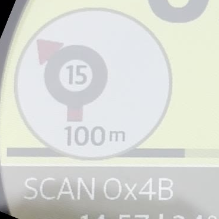 |
| `0x4C` | ✅ ⟳16 | **Roundabout CW — take exit 16** | 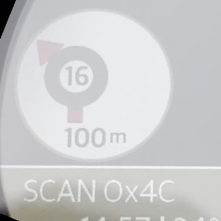 |
| `0x4D` | 🟡 ⟳17 | **Roundabout CW — take exit 17** | 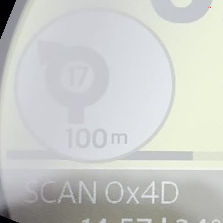 |
| `0x4E` | 🟡 ⟳18 | **Roundabout CW — take exit 18** | 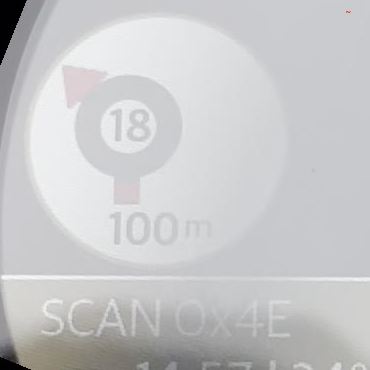 |
| `0x4F` | ✅ ⟳19 | **Roundabout CW — take exit 19** | 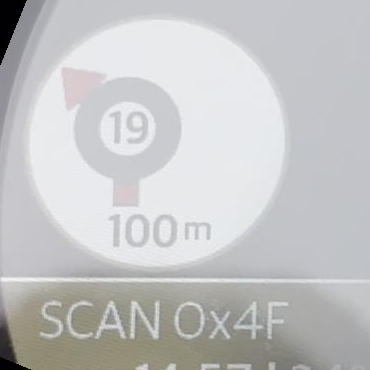 |
| `0x50` | ✅ ⟲10 | **Roundabout CCW — take exit 10** (counter-clockwise / left-hand-traffic style) | 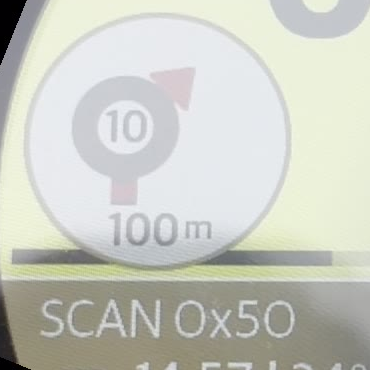 |
| `0x51` | ✅ ⟲11 | **Roundabout CCW — take exit 11** | 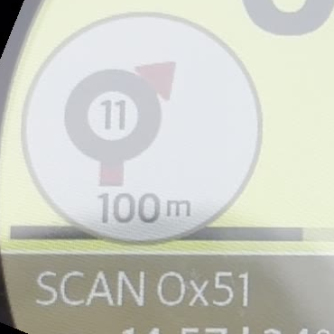 |
| `0x52` | ✅ ⟲12 | **Roundabout CCW — take exit 12** |  |
| `0x53` | ✅ ⟲13 | **Roundabout CCW — take exit 13** | 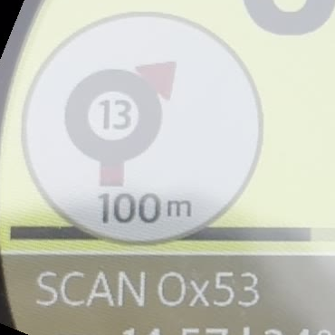 |
| `0x54` | ✅ ⟲14 | **Roundabout CCW — take exit 14** | 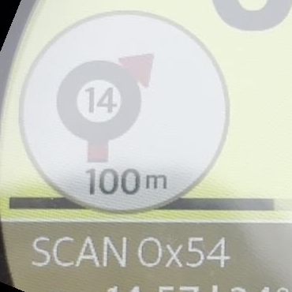 |
| `0x55` | ✅ ⟲15 | **Roundabout CCW — take exit 15** | 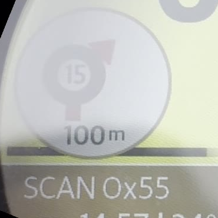 |
| `0x56` | 🟡 ⟲16 | **Roundabout CCW — take exit 16** | 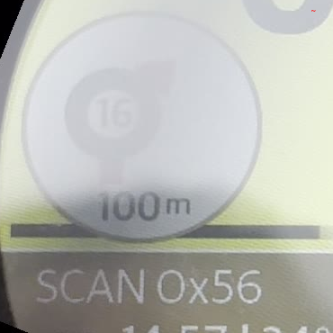 |
| `0x57` | 🟡 ⟲17 | **Roundabout CCW — take exit 17** | 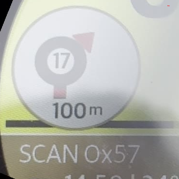 |
| `0x58` | ✅ ⟲18 | **Roundabout CCW — take exit 18** | 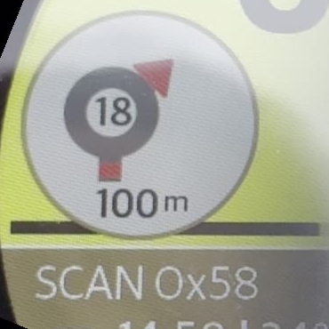 |
| `0x59` | ✅ ⟲19 | **Roundabout CCW — take exit 19** |  |
| `0x5A`..`0xFF` | ⚫ hidden | **Hidden bubble** — overlay fully suppressed (every byte in range, field-verified) | — |

## How to regenerate

```bash
# 1. Run scanner mode on phone via ManeuverScannerLoop with holdSeconds=5.
# 2. Mount Tripper, ride briefly, switch to "Active Nav (Scan)" mode.
# 3. Record video of the dash (selfie stick + 1080p phone camera works
#    better than the in-app UDP recorder for visual clarity).
# 4. Crop video to dash + rotate so the SCAN text is horizontal:

ffmpeg -i SCAN_VIDEO.mov \
  -vf "rotate=22*PI/180:ow=rotw(22*PI/180):oh=roth(22*PI/180):c=black,fps=0.5" \
  -q:v 3 frames/f_%03d.jpg

# 5. Extract bubble + SCAN label region for each frame (self-labeling):
#    crop = (100, 460, 470, 830)  →  370×370 px
#    bubble visible at top, "100 m" beneath, "SCAN 0xNN" along the bottom.

# 6. OCR the SCAN label to get the ground-truth byte for each frame,
#    then map first-occurrence frame → byte for the catalog file name.

# 7. For bytes without an OCR anchor, linearly interpolate between
#    neighbouring anchors and flag the entry as 🟡 interpolated.

# 8. Verify each glyph by reading the SCAN label inside the PNG itself.
```

## Open questions / pending work

- [ ] **Re-verify roundabout-exit numbering**: catalog assigns CW
      exits 0..9 to `0x0A..0x13` (small style) and `0x31..0x3A`
      (large style), CW exits 10..19 to `0x46..0x4F`, CCW exits 10..19
      to `0x50..0x59`. Field-test by sending each byte while a
      multi-exit roundabout is active and confirm the rendered number.
- [ ] **Verify CCW exits 0..9**: the catalog has no obvious slot for
      `⟲0..⟲9` — they may be missing from `0x00..0x59` entirely, or
      reusing the CW glyphs. Check before assuming left-hand-traffic
      coverage.
- [ ] **Confirm `0x3E` (ferry) and `0x3F` (train)**: by sending each
      byte during a route — both are visually distinct from the
      turn/roundabout family but unconfirmed by field use.
- [ ] **Identify `0x42`**: looks like a signal-strength / Wi-Fi icon,
      not a navigation maneuver — may be a status indicator that
      leaked into the maneuver enum, or a "no GPS" warning glyph.
- [ ] **Direction-bit hypothesis** (was raised under earlier mapping):
      whether bits 7..4 control rotation direction for roundabouts —
      drop and re-derive after re-classification
- [ ] **Non-visual side effects in `0x5A..0xFF`**: bubble is suppressed,
      but does any byte in that range still trigger non-visual effects
      (beep, text bar, vibration)? — needs separate test

## See also

- [`ManeuverScannerLoop.swift`](../../TripperDashPP/Navigation/ManeuverScannerLoop.swift) — Scanner implementation (walks `0x00..0xFF`, burns `SCAN 0xNN` label into the video stream)
- [`ManeuverScanSource.swift`](../../TripperDashPP/Stream/ManeuverScanSource.swift) — Video overlay that burns the ground-truth label
- [`ManeuverIcon.swift`](../../TripperDashPP/Navigation/Models/ManeuverIcon.swift) — Asset-free glyph renderer for the phone-side burned arrow (used when the dash enum is untrusted)
- [Overview grid (90 visible glyphs captured)](all-glyphs-overview.jpg)
